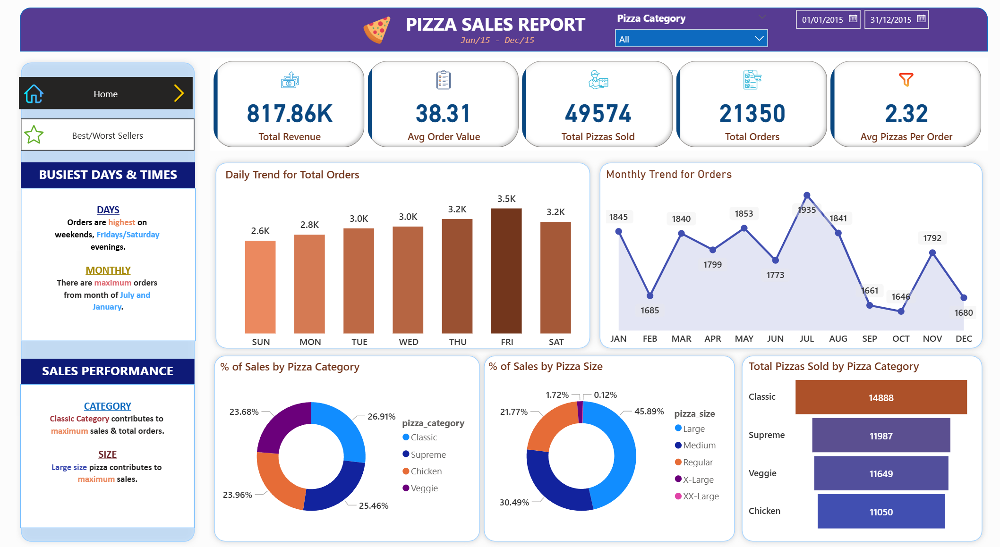
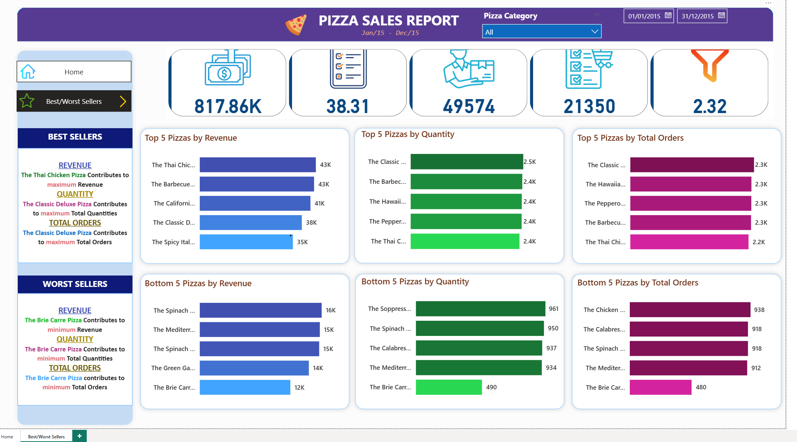

# Pizza-Sales-Dashboard-Project-PowerBI

🍕 **Pizza Sales Dashboard – SQL & Power BI Project**

This project analyses a full year of pizza sales data using **SQL and Power BI** to uncover business performance trends, identify key revenue drivers, and build a clear set of decision ready insights.

The aim of the project was to design an end-to-end data analytics workflow from importing raw CSV files, transforming data in SQL Server, calculating queries through SQL, and finally visualising the insights in an interactive Power BI dashboard.

🔍 Project Objectives

- Import and clean raw pizza sales CSV data in SQL Server.

- Use SQL queries to extract key business metrics (KPIs).

- Analyse ordering behaviour and performance across dates, times, categories, and pizza sizes.

- Build a fully interactive Power BI dashboard showing performance trends.

- Provide insights that could support business decisions such as staffing, menu optimisation, and marketing strategies.

**Tools Used**

- Microsoft SQL Server

- SQL (T-SQL Queries)

- Excel (initial transformation)

- Power BI Desktop

**Key Metrics (KPIs)**

The following KPIs were computed using SQL:

- Total Revenue

Total amount generated from all pizzas sold.

- Average Order Value (AOV)

Revenue per order.

- Total Pizzas Sold

Total number of pizzas purchased.

- Total Orders

Count of unique orders placed.

- Average Pizzas Per Order

Shows typical customer order size.

Example:

More queries were created for trend analysis, percentage of sales by pizza size and best/worst sellers. 

📈 **Dashboard Visuals**

An example of Power BI dashboard includes:

1️. Daily Trend of Orders

Shows which days customers order most.
Helps with staffing & operational planning.

2️. Monthly Trend of Orders

Reveals seasonal or monthly fluctuations.
Useful for marketing & forecasting.

3️. Sales by Pizza Category

Breakdown of categories such as Classic, Supreme, Veggie, Chicken, etc.
Shows which categories drive the most revenue.

4️. Sales by Pizza Size

Percentage breakdown of S, M, L, XL sales.
Supports pricing & product strategy.

5️. Total Pizzas Sold by Category Table

Quick comparison across product groups.

**What the Analysis Revealed**
1.  Total Revenue & Volume
The business generated £817K+ in sales with 49K+ pizzas sold across the year.
This highlights a strong, consistent operating base.

2.  Customer Ordering Behaviour
Orders peak on Fridays and Saturdays, showing classic weekend demand behaviour.
Across the year, sales show expected seasonality with increases in busier months.

3.  Best-Performing Categories
Classic pizzas contributed the highest share of total sales.
Supreme and Chicken categories also performed strongly.
This would help a business prioritise stock, promotional spend, and menu visibility.

4.  Pizza Size Preference
Large pizzas account for the highest proportion of sales.
Smaller sizes contribute less than expected, which could indicate opportunities for pricing strategy changes.

5.  Average Order Value Insight
The average order value (~£38) suggests customers frequently buy multiple items per order-consistent with family or group ordering behaviour.

**Overall Patterns & Business Interpretation**

- Chicken and classic flavours dominate sales, indicating strong preference for familiar, hearty, flavour-forward options.

-Vegetarian and specialty pizzas underperform, signaling an opportunity to:

     Refresh recipes

     Rebrand the category

     Consider discontinuing specific items

The top sellers show both high revenue AND high volume, reinforcing that customers are buying them frequently not just because of higher price points.

🧠 **Key Learnings & Achievements**

Built a complete SQL-to-Power BI analytics workflow.

Strengthened SQL querying skills with joins, aggregations, filtering, and KPI creation.

Designed a clean, business-ready Power BI dashboard.

Turned raw operational data into clear, actionable insights relevant to stakeholders.

